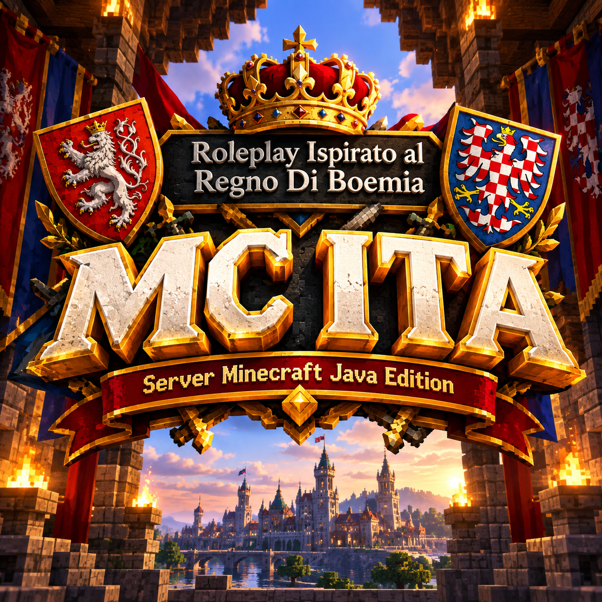

<div align="center">



# 🚀 MC ITA Launcher

### Il launcher ufficiale della community italiana MC ITA

*Un click e sei dentro Minecraft. Zero competenze tecniche.*

<br>

[](https://github.com/enrigadda-cell/MC-ITA-Launcher/releases/latest)
[](https://github.com/enrigadda-cell/MC-ITA-Launcher/releases)
[](https://github.com/enrigadda-cell/MC-ITA-Launcher)
[](LICENSE)

<br>

[](https://discord.gg/XCSZ3XfyQg)
[](https://github.com/enrigadda-cell/MC-ITA-Launcher)

<br>

### 🎉 Versione 1.0.1 disponibile!

**Il download ufficiale è disponibile sul nostro Discord, canale `#annunci`.**

[](https://discord.gg/XCSZ3XfyQg)

*Un click e sei dentro Minecraft moddato.*

</div>

---

## 📑 Indice

- [✨ Cos'è MC ITA Launcher](#-cosè-mc-ita-launcher)
- [🎯 Cosa fa automaticamente](#-cosa-fa-automaticamente)
- [📥 Come si usa](#-come-si-usa)
- [⚙️ Requisiti di sistema](#️-requisiti-di-sistema)
- [🧩 Funzionalità](#-funzionalità)
- [🐛 Problemi comuni](#-problemi-comuni)
- [❓ FAQ](#-faq)
- [💬 Community](#-community-e-supporto)
- [👥 Il team](#-il-team)
- [📜 Licenza](#-licenza)

---

## ✨ Cos'è MC ITA Launcher

**MC ITA Launcher** è il launcher ufficiale della community italiana **MC ITA**.

Trasforma un PC Windows qualsiasi in una **postazione pronta per Minecraft moddato**. Non serve sapere cos'è Java, NeoForge o SKLauncher: clicchi un pulsante, aspetti 3-5 minuti, e sei dentro il gioco con tutto configurato.

**Non è solo per l'installazione iniziale** — il launcher ti permette anche di:
- 🔄 **Aggiornare il modpack** quando esce una nuova versione delle mod
- 💾 **Fare backup automatici** della cartella mod prima di ogni aggiornamento
- 🎯 **Gestire l'intera istanza MC ITA** senza aprire un solo terminale

> 💡 **Pensato per chi non vuole sbattere la testa con configurazioni tecniche.**

Unisciti alla community sul nostro **[Discord ufficiale](https://discord.gg/XCSZ3XfyQg)** — lì trovi il download ufficiale, il supporto e tutte le guide.

---

## 🎯 Cosa fa automaticamente

Il launcher **INSTALLAZIONE GENERALE** fa tutto questo in sequenza:

| Step | Componente | Azione |
|:---:|---|---|
| **1** | ☕ **Java 21 Temurin** | Download + installazione silenziosa + configurazione automatica |
| **2** | 🎮 **Minecraft 1.21.1** | Download pacchetto base ufficiale Mojang + estrazione |
| **3** | 🛠️ **NeoForge 21.1.248** | Configurazione del modloader moderno |
| **4** | 👤 **Profilo "MC ITA 1.21.1"** | Creazione profilo dedicato in SKLauncher con RAM scelta |
| **5** | 📦 **Modpack MC ITA** | Download + estrazione di tutte le mod |
| **6** | 🖥️ **Scorciatoia Desktop** | Collegamento con logo MC ITA |
| **7** | 🎓 **Tutorial Nickname** | Guida interattiva in 4 step |
| **8** | 🚀 **Avvio SKLauncher** | Apertura automatica con profilo già pronto |

**Tutto automatico. Zero competenze richieste.**

---

## 📥 Come si usa

### 🔽 Passo 1 — Scarica il launcher

**Il download ufficiale è disponibile sul nostro Discord, canale `#annunci`.**

<div align="center">

[](https://discord.gg/XCSZ3XfyQg)

</div>

**Requisiti**: Windows 10/11 (64-bit) — ~63 MB

> ⚠️ **Nota bene**: Windows SmartScreen potrebbe bloccare l'EXE al primo avvio. Clicca **"Ulteriori informazioni"** → **"Esegui comunque"**. È normale per software appena pubblicato senza firma digitale a pagamento.

### 🖱️ Passo 2 — Lancia il launcher

Fai **doppio click** sull'EXE. Si apre lo splash screen animato, poi la dashboard principale.

### 🎛️ Passo 3 — Clicca INSTALLAZIONE GENERALE

Nella dashboard clicca la card **INSTALLAZIONE GENERALE** (quella verde).

### 📖 Passo 4 — Leggi le 3 card informative

Prima di procedere, il launcher ti mostra 3 card che spiegano:
- **MEMORIA RAM** — quanta assegnarne a Minecraft
- **POSIZIONE** — dove installare tutto
- **OPZIONI** — cosa farà il launcher

Devi scorrere ogni card fino in fondo per poter procedere. È una feature, non un bug: così sai esattamente cosa succederà.

### 🎚️ Passo 5 — Scegli la RAM

| RAM PC | RAM consigliata per MC |
|---|---|
| 8 GB | 4 GB |
| 16 GB | 6-8 GB |
| 32 GB | 12-16 GB |

**Regola d'oro**: lascia sempre almeno **4 GB liberi** per Windows.

### ✅ Passo 6 — Conferma

Clicca **CONFERMA** e aspetta. Il launcher fa tutto da solo.

Durante l'installazione di Java, Windows chiederà **permessi di amministratore (UAC)**: accetta, è necessario.

### 🎮 Passo 7 — Gioca!

Alla fine SKLauncher si apre da solo con il profilo **MC ITA 1.21.1** già selezionato. Clicca **Play** e buon divertimento!

---

## ⚙️ Requisiti di sistema

| Componente | Minimo | Consigliato |
|---|---|---|
| **Sistema operativo** | Windows 10 (64-bit) | Windows 11 |
| **Processore** | Intel i3 / AMD Ryzen 3 | Intel i5 / AMD Ryzen 5+ |
| **RAM** | 8 GB | 16 GB o superiore |
| **Spazio su disco** | 15 GB liberi | 25 GB liberi |
| **Connessione** | 10 Mbps | 50 Mbps o superiore |
| **Scheda video** | Integrata | Dedicata (GTX 1050+) |
| **Java** | ✅ **Non necessario** — viene installato dal launcher | — |

---

## 🧩 Funzionalità

### 🔄 Aggiorna Solo Mod

**Questa è la funzionalità principale dopo l'installazione iniziale.**

Quando esce un aggiornamento del modpack, non devi reinstallare tutto. Usa la card **AGGIORNA SOLO MOD**:

<table>
<tr>
<td width="33%" valign="top">

**🎯 Installa automaticamente**

Il launcher:
- Trova da solo la cartella mods
- Fa **backup sul Desktop** delle mod attuali
- Pulisce la cartella
- Scarica e installa le nuove mod
- Verifica i duplicati

**Consigliato** per la maggior parte degli utenti.

</td>
<td width="33%" valign="top">

**📁 Estrai in cartella personalizzata**

Scegli tu dove mettere i `.jar`.

Utile se:
- Hai Minecraft in un percorso diverso
- Vuoi gestire le mod manualmente
- Hai più istanze

</td>
<td width="33%" valign="top">

**💾 Scarica solo lo ZIP**

Solo download, niente estrazione.

Utile per:
- Backup manuale
- Trasferire su un altro PC
- Gestire le mod a mano

</td>
</tr>
</table>

### 💾 Ripresa installazione

Se chiudi il launcher durante l'installazione (o va in crash), al riavvio ti chiede:

> *"L'ultima installazione si è interrotta alla fase X. Vuoi riprendere da dove eri rimasto?"*

Se dici **Sì** → riprende dalla fase interrotta, senza rifare tutto.

### 📋 Log di sistema

Ogni operazione è registrata in un log dettagliato. Se hai problemi:

1. Apri il launcher → **Impostazioni**
2. Clicca **ESPORTA LOG**
3. Si crea uno ZIP con tutti i log
4. Aprilo con Blocco Note, cerca la parola `ERROR` e incollalo sul nostro Discord

Lo staff di MC ITA lo analizzerà e ti risponderà con la soluzione.

### 🎮 Tutorial Nickname

Dopo l'installazione si apre automaticamente una guida illustrata in **4 step**:

1. **Apri SKLauncher** — dove cliccare
2. **Scegli modalità** — offline o Microsoft
3. **Inserisci nickname** — con regole chiare
4. **Conferma** — puoi cambiare skin con Quick Skin

Puoi rivederlo in qualsiasi momento da **Dashboard → 🎮 Come cambiare Nickname**.

### 🎨 Interfaccia

- **Dashboard** → Centro operativo con 5 card
- **Terminale live** → Vedi ogni operazione in tempo reale
- **Impostazioni** → Versioni e esportazione log
- **Splash screen** animato stile LineageOS

---

## 🐛 Problemi comuni

### ⚠️ Windows SmartScreen blocca l'EXE

**Sintomo**: al primo avvio appare *"Windows ha protetto il PC"*.

**Soluzione**:
1. Clicca **"Ulteriori informazioni"**
2. Clicca **"Esegui comunque"**

È normale per software appena pubblicato senza firma digitale.

### ⚠️ UAC chiede permessi durante Java

**Sintomo**: durante l'installazione di Java Windows mostra *"Consenti a questa app di fare modifiche?"*.

**Soluzione**: clicca **Sì**. È necessario per installare Java.

### ⚠️ Il launcher sembra bloccato durante Java

**Sintomo**: dopo aver accettato UAC, la finestra si blocca per 30-60 secondi.

**Soluzione**: **aspetta**. Non chiudere. L'installazione di Java richiede tempo. Vedrai un overlay con spinner animato.

### ⚠️ Errore durante il download

**Sintomo**: il download si interrompe o fallisce.

**Soluzione**:
1. Verifica la connessione internet
2. Disattiva antivirus/firewall temporaneamente
3. Riprova — il launcher fa **fino a 5 tentativi automatici**

### ⚠️ Minecraft crasha all'avvio

**Sintomo**: clicchi Play e Minecraft si chiude subito.

**Soluzione**:
1. Verifica di aver assegnato **almeno 4 GB** di RAM
2. Esporta i log da **Impostazioni → ESPORTA LOG**
3. Incollali sul nostro Discord nel canale `#generale`

---

## ❓ FAQ

<details>
<summary><b>Devo pagare qualcosa per usare il launcher?</b></summary>

No, è completamente gratis. Fa parte della community MC ITA.
</details>

<details>
<summary><b>Serve Minecraft originale?</b></summary>

No, funziona anche con account **offline** (cracked). Se possiedi Minecraft originale, puoi accedere con Microsoft.
</details>

<details>
<summary><b>È legale?</b></summary>

Sì. Il launcher **non distribuisce Minecraft** — scarica la versione ufficiale Mojang. È uno strumento di comodità per configurare automaticamente una modpack.
</details>

<details>
<summary><b>Devo installare Java manualmente?</b></summary>

**No.** Il launcher installa Java 21 automaticamente e configura tutto.
</details>

<details>
<summary><b>Posso usarlo su Mac o Linux?</b></summary>

**No, solo Windows.** Il launcher usa strumenti Windows per l'installazione automatica di Java.
</details>

<details>
<summary><b>Rallenta il PC?</b></summary>

No. È un launcher, non un'applicazione sempre in esecuzione.
</details>

<details>
<summary><b>Posso tornare al mio Minecraft personale?</b></summary>

**Sì.** MC ITA Launcher usa una cartella istanza isolata. Il tuo `.minecraft` personale rimane intatto.
</details>

<details>
<summary><b>Come disinstallo tutto?</b></summary>

1. Cancella `%APPDATA%\.minecraft\instances\mc_ita_1211\`
2. Cancella `%APPDATA%\MC_ITA_Launcher\`
3. Cancella `%LOCALAPPDATA%\MCITA\`
4. Rimuovi la scorciatoia dal Desktop

Fatto.
</details>

<details>
<summary><b>Come aggiorno il launcher?</b></summary>

1. Vai sul canale `#annunci` del Discord
2. Scarica il nuovo launcher
3. Sostituisci quello vecchio

Le tue installazioni rimangono intatte.
</details>

---

## 💬 Community e supporto

### 🎮 Discord Ufficiale MC ITA

Il posto migliore dove chiedere aiuto e restare aggiornato:

👉 **[Unisciti al Discord MC ITA](https://discord.gg/XCSZ3XfyQg)**

**Canali utili**:
- 📢 **#annunci** → nuove release, eventi, aggiornamenti importanti, download ufficiale
- 💬 **#generale** → chiacchiere, aiuto veloce, community

### 🐛 Bug e problemi tecnici

Se hai trovato un bug:
1. Esporta i log dal launcher (**Impostazioni → Esporta Log**)
2. Scrivi sul Discord in `#generale`
3. Oppure apri una **Issue** su GitHub: **[Apri una Issue](https://github.com/enrigadda-cell/MC-ITA-Launcher/issues)**

### 📧 Contatti

- **Autore principale**: [Chairman-Enrico](https://github.com/enrigadda-cell)
- **Co-fondatore**: Walter
- **Discord**: entra nel server e cerca lo staff

---

## 👥 Il team

**MC ITA** nasce da **due giovani** appassionati di Minecraft, con l'obiettivo di offrire un server fluido, prestante e con una community accogliente.

<div align="center">

| | |
|:---:|:---:|
| **🚀 Chairman-Enrico** | **💻 Walter** |
| Fondatore e sviluppatore del launcher | Co-fondatore |
| [GitHub](https://github.com/enrigadda-cell) | — |

</div>

Se vuoi far parte del team o contribuire al progetto, scrivici sul [Discord](https://discord.gg/XCSZ3XfyQg)!

---

## 📜 Licenza

```
MIT License

Copyright (c) 2026 Chairman-Enrico, Walter

Permission is hereby granted, free of charge, to any person obtaining a copy
of this software and associated documentation files (the "Software"), to deal
in the Software without restriction, including without limitation the rights
to use, copy, modify, merge, publish, distribute, sublicense, and/or sell
copies of the Software, and to permit persons to whom the Software is
furnished to do so, subject to the following conditions:

The above copyright notice and this permission notice shall be included in all
copies or substantial portions of the Software.

THE SOFTWARE IS PROVIDED "AS IS", WITHOUT WARRANTY OF ANY KIND, EXPRESS OR
IMPLIED, INCLUDING BUT NOT LIMITED TO THE WARRANTIES OF MERCHANTABILITY,
FITNESS FOR A PARTICULAR PURPOSE AND NONINFRINGEMENT. IN NO EVENT SHALL THE
AUTHORS OR COPYRIGHT HOLDERS BE LIABLE FOR ANY CLAIM, DAMAGES OR OTHER
LIABILITY, WHETHER IN AN ACTION OF CONTRACT, TORT OR OTHERWISE, ARISING FROM,
OUT OF OR IN CONNECTION WITH THE SOFTWARE OR THE USE OR OTHER DEALINGS IN THE
SOFTWARE.
```

---

## ⚠️ Disclaimer legale

**MC ITA Launcher** è un progetto **indipendente** creato dalla community italiana MC ITA.

**Non è affiliato** con:
- Mojang Studios
- Microsoft Corporation
- SKLauncher
- NeoForge
- Eclipse Adoptium

**Non distribuisce** file protetti da copyright. Scarica Minecraft dalla fonte ufficiale Mojang e utilizza API pubbliche per l'installazione di Java 21.

Tutti i marchi citati appartengono ai rispettivi proprietari.

---

<div align="center">

### ❤️ Creato con passione da Chairman-Enrico & Walter

*Se questo progetto ti è piaciuto, lascia una ⭐ al repository!*

<br>

[](https://github.com/enrigadda-cell/MC-ITA-Launcher)
[](https://discord.gg/XCSZ3XfyQg)

<br>

**🎮 Buon divertimento su MC ITA!**

</div>
